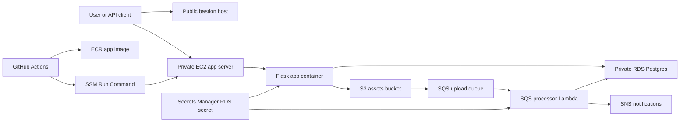

# Travel Platform Infrastructure

This repo is a portfolio-ready AWS travel platform built with Terraform, Flask, Postgres, S3, SQS, Lambda, and GitHub Actions. The app lets a user create trips, track expenses, generate presigned S3 photo uploads, process upload events asynchronously, and view the result in a server-rendered dashboard.

## Architecture



## What Is Included

- Terraform modules for VPC, subnets, route tables, VPC endpoints, security groups, IAM, EC2, RDS, S3, SQS, SNS, Lambda, and S3 notifications.
- Flask API for trips, expenses, photo presign requests, health checks, and dashboard rendering.
- SQLAlchemy models and Alembic migrations for users, trips, expenses, and photos.
- RDS-managed master password stored in Secrets Manager.
- S3 object-created notifications wired to SQS.
- Lambda SQS consumer that marks uploaded photos as processed in Postgres.
- GitHub Actions pipeline that builds/pushes the app image and deploys through SSM.

## Repository Layout

```text
.
+-- app/
|   +-- app.py
|   +-- db.py
|   +-- models.py
|   +-- routes/
|   +-- migrations/
|   +-- templates/
+-- terraform/
|   +-- compute/
|   +-- database/
|   +-- messaging/
|   +-- network/
|   +-- notifications/
|   +-- security/
|   +-- storage/
+-- .github/
|   +-- scripts/deploy_app.sh
|   +-- workflows/deploy.yml
+-- main.tf
+-- variables.tf
+-- outputs.tf
```

## Prerequisites

- AWS account with permissions for VPC, EC2, RDS, S3, SQS, SNS, Lambda, IAM, ECR, Secrets Manager, and CloudWatch.
- Terraform installed locally.
- Docker installed locally if you want to build images outside CI.
- GitHub OIDC role created by Terraform and allowed to push ECR images and run SSM commands.
- An EC2 key pair name for bastion/app access.

## Terraform Variables

Create a local `terraform.tfvars` file. It is ignored by git.

```hcl
aws_region            = "ap-south-2"
key_name              = "your-ec2-keypair-name"
bucket_name           = "your-unique-assets-bucket-name"
notification_email    = "you@example.com"
enable_lambda_trigger = true
```

Do not store database passwords in `terraform.tfvars`. RDS manages the master password and stores it in Secrets Manager.

## Infrastructure Deploy

```bash
terraform init
terraform fmt -recursive
terraform plan
terraform apply
```

Important outputs:

- `bastion_public_ip`
- `app_private_ip`
- `db_endpoint`
- `sqs_queue_url`
- `sns_topic_arn`

## Application Deploy Flow

The GitHub Actions workflow builds the Flask app image and pushes both `latest` and the commit SHA tag to ECR.

Deployment is performed with SSM Run Command:

1. CI uploads the current repo deploy script to the EC2 app server.
2. The app server logs in to ECR.
3. It pulls the requested image tag.
4. It runs `python -m alembic -c alembic.ini upgrade head` from that image.
5. It restarts the `travel-app` container only after migrations succeed.

This avoids stale EC2-local deployment scripts and keeps schema updates tied to app deploys.

## Local App Commands

Install app dependencies:

```bash
python3 -m pip install -r app/requirements.txt
```

Run Alembic history:

```bash
python3 -m alembic -c app/alembic.ini history
```

Run the Flask app locally when database env vars are available:

```bash
export DB_HOST="localhost"
export DB_NAME="appdb"
export DB_USER="postgres"
export DB_PASSWORD="postgres"
python3 app/app.py
```

## API Examples

Create a trip:

```bash
curl -X POST http://APP_HOST:3000/trips \
  -H "Content-Type: application/json" \
  -d '{
    "name": "Sydney Demo Trip",
    "start_date": "2026-05-01T00:00:00",
    "end_date": "2026-05-05T00:00:00"
  }'
```

List trips:

```bash
curl http://APP_HOST:3000/trips
```

Add an expense:

```bash
curl -X POST http://APP_HOST:3000/trips/1/expenses \
  -H "Content-Type: application/json" \
  -d '{
    "amount": 42.50,
    "currency": "INR",
    "category": "food",
    "description": "Dinner",
    "spent_at": "2026-05-02T19:30:00"
  }'
```

Generate a presigned upload URL:

```bash
curl -X POST http://APP_HOST:3000/trips/1/photos/presign \
  -H "Content-Type: application/json" \
  -d '{
    "filename": "boarding-pass.jpg",
    "content_type": "image/jpeg",
    "file_size": 524288
  }'
```

Upload the file directly to S3 using the returned URL:

```bash
curl -X PUT "PRESIGNED_UPLOAD_URL" \
  -H "Content-Type: image/jpeg" \
  --upload-file ./boarding-pass.jpg
```

Open the dashboard:

```text
http://APP_HOST:3000/dashboard
```

## Demo Script

1. Run `terraform apply`.
2. Confirm the SNS email subscription if prompted by AWS.
3. Push to `main` or run the GitHub Actions workflow manually.
4. Create a trip with `POST /trips`.
5. Add an expense with `POST /trips/{trip_id}/expenses`.
6. Request a presigned URL with `POST /trips/{trip_id}/photos/presign`.
7. Upload a file to the returned S3 URL.
8. Wait for S3 -> SQS -> Lambda processing.
9. Open `/dashboard` and verify the trip, expense, and photo status.

## Operations

- Flask health check: `GET /healthz`
- App logs: `docker logs travel-app`
- Manual app deploy on EC2: `/home/ec2-user/update_app.sh IMAGE_TAG`
- Lambda logs: CloudWatch Logs for `travel_platform_sqs_processor`
- Failed upload-processing events: `travel_platform_dlq`

## Current Hardening Notes

- The MVP uses a fixed demo user.
- Photo uploads use presigned S3 URLs; Flask does not proxy upload bodies.
- S3 upload processing is handled by Lambda, not by a long-running worker container.
- Lambda publishes SNS notifications after successful photo processing.
